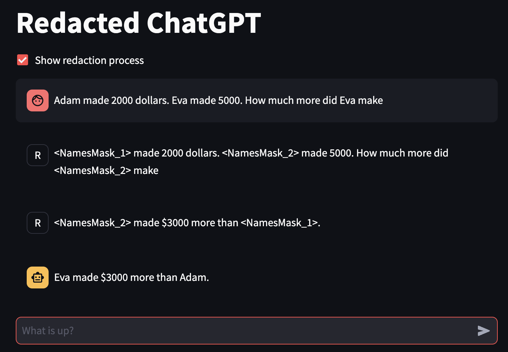

# A redaction wrapper around GPT

This is a wrapper of GPT (or other LLMs) such that when your prompt includes personal information (e.g. name, email, phone number), this information is redacted and not sent to GPT. The response from GPT is then back-filled with the personal information you provided, such that the user experience not impacted compared to a nake communication with GPT.

## App Screenshot



## Quickstart

```
streamlit run app.py
```


## Dependency

This repo uses a modified version of [masked-ai](https://github.com/cado-security/masked-ai).